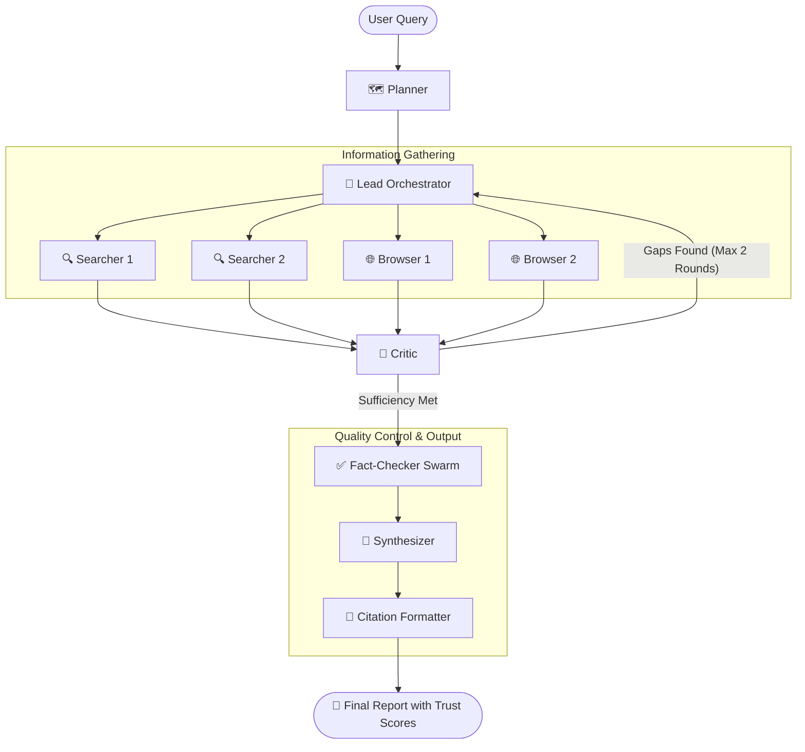

# 🌊 Multi-Agent Deep Researcher Swarm

[](https://fastapi.tiangolo.com)
[](https://nextjs.org)
[](https://github.com/langchain-ai/langgraph)
[](https://reactflow.dev)
[](https://langfuse.com)
[](https://www.docker.com)

An open-source, production-ready **Hierarchical Orchestrator-Worker Multi-Agent Swarm** designed for deep, autonomous research. Built with **LangGraph**, **FastAPI**, **Next.js 15**, and **ReactFlow**, this system resolves the core limitations of single-agent systems by distributing context, separating concerns among specialized agents, and enforcing strict quality-control feedback loops.

---

## 🛠️ Technology Stack

| Layer | Technology | Purpose / Description |
| :--- | :--- | :--- |
| **Frontend Framework** | **Next.js 15 (App Router)** | Client dashboard application with React 19 concurrent features. |
| **Styling** | **Tailwind CSS & Vanilla CSS** | Modern glassmorphic styling and interactive responsive layouts. |
| **Pipeline Visualization** | **ReactFlow** | Renders the real-time interactive Node Agent Execution Tree. |
| **State Management (UI)** | **Zustand** | Lightweight client-side store managing streaming session states and history. |
| **Backend API Server** | **FastAPI** | High-performance Python ASGI server handling endpoints and Server-Sent Events (SSE). |
| **Orchestration Engine** | **LangGraph** | Graph-based state machine defining the multi-agent nodes, feedback loops, and transitions. |
| **observability & Tracing** | **Langfuse v4** | Distributed tracing for agents, prompt versioning, and LLM invocation logging. |
| **System Tracing** | **OpenTelemetry** | Standardized instrumentation for database requests, endpoints, and background workers. |
| **Hot Cache & SSE Stream** | **Redis** | High-speed cache storing active session states and buffering real-time events. |
| **Relational Database** | **PostgreSQL (asyncpg)** | Stores user API keys, persistent sessions metadata, and rate limit counters. |
| **Citation Graph Database** | **Neo4j** | Stores semantic citation trees mapped as `Claims → Sources → URLs`. |
| **Text Embedding Engine** | **ONNX Runtime** | Local CPU feature extraction utilizing the `all-MiniLM-L6-v2` model for cosine similarity checking. |
| **Content Fetching** | **Playwright** | Autonomously browses JS-rendered pages and extracts PDF files in parallel. |
| **Search Tools** | **Tavily API** | LLM-optimized web search tool returning clean, formatted content. |
| | **Serper API** | Fresh, real-time Google search results for current events. |
| | **Exa.ai API** | Neural/semantic search tool optimized for academic and clean page content. |
| | **arXiv API** | Fetches academic papers, authors, abstracts, and preprints. |
| | **GitHub API** | Extracts code repositories, file contents, and project READMEs. |

---

## 🎯 The Core Problem: Why Single Agents Fail at Research

Single-agent systems hit a hard ceiling on long, complex research tasks due to three root causes:

1. **🌊 Context Window Pollution (Quality Collapse):** By tool call 15, a single agent's context is saturated with thousands of lines of raw search results. The model experiences a quality collapse. **Our Solution:** Distribute context across isolated, stateless worker agents.
2. **🎭 Lack of Specialization (Mediocre Generalist):** A single agent prompted to "be a researcher" tries to plan, search, filter, critique, and write. It is mediocre at all of them. **Our Solution:** Separate concerns into a team of specialized agents: Planner, Searchers, Browsers, Critic, Fact-Checkers, Synthesizer, and Citation Formatter.
3. **🪞 Lack of Self-Correction (Hallucinations):** Single agents confabulate confidently. Without an adversarial review process, logical leaps and sourceless claims go unchecked. **Our Solution:** An adversarial Critic-Searcher loop and automated Fact-Checker agents.

---

## 🏗️ Architectural Pattern: Hierarchical Orchestrator-Worker

We bypass the chaotic "free-for-all" communication model (where agents converse without structure) in favor of a **Hierarchical Orchestrator-Worker Swarm**, similar to the systems developed by Anthropic and OpenAI.

*   **Lead Orchestrator:** Decomposes the research query, dispatches sub-tasks, and merges findings.
*   **Worker Agents:** Fully stateless execution units that receive a task, query assigned tools, extract findings, and return a clean summary.
*   **Deterministic Control Flow:** Built on **LangGraph**, allowing Native Cycles (Critic loops) while maintaining complete debuggability and resume states.



---

## 🧮 The Agent Swarm Math

A single research query triggers **10 to 24 parallel agent invocations** under the hood:
$$\text{Swarm Size} = 1\text{ Orchestrator} + 1\text{ Planner} + (3\text{--}8)\text{ Searchers} + (2\text{--}3)\text{ Browsers} + (1\text{--}2)\text{ Critic Rounds} + (1\text{--}8)\text{ Fact Checkers} + 1\text{ Synthesizer} + 1\text{ Citation Formatter}$$

---

## 🎭 Agent Roster

The swarm is divided into four functional tiers. Dynamic routing assigns tasks to the designated LLM endpoints (customizable per user via Settings/BYOK):

| Tier | Agent | Role & Responsibility |
| :--- | :--- | :--- |
| **Tier 1: Coordination** | **🎯 Lead Orchestrator** | Decomposes the query into 3–8 sub-questions, dispatches workers, tracks shared state, and evaluates search sufficiency. |
| | **🗺️ Planner** | Formulates the research strategy, identifies key entities to investigate, and assigns tool routes. |
| **Tier 2: Info Gathering** | **🔍 Searcher Workers** | 3–8 stateless parallel workers that execute targeted searches (Tavily, Arxiv, DDG, etc.) and return a 200–500 token summary. |
| | **🌐 Browser Workers** | Playwright/Fetcher instances (up to 3 parallel) that extract full content from primary URLs and parse PDFs. |
| **Tier 3: Quality Control**| **🔬 Critic** | Conducts adversarial reviews of findings to detect gaps, triggering loop-backs to Searchers (Capped at 2 rounds). |
| | **✅ Fact-Checker** | Isolates claims and performs independent cross-verification searches (up to 8 parallel instances) to output trust scores. |
| **Tier 4: Output** | **📝 Synthesizer** | Gathers verified claims and approved sources to write a clean Markdown report with inline citations. |
| | **📎 Citation Formatter** | Checks embedding similarity (threshold: 0.7) between claims and source snippets to prevent hallucinated citations. |

---

## 🔑 Bring-Your-Own-Key (BYOK) & Free Tier

The application provides a flexible model quota system based on user authentication:

1. **Free Tier:** Users without custom API keys are limited to **1 daily free query** using the system default keys. The free tier uses the following pre-configured models:
   * **Google Gemini** models (e.g. `gemini-2.5-flash`) for the **Synthesizer**.
   * **OpenRouter `gpt-oss-120b`** for **Reasoning** agents (Planner, Orchestrator, Critic).
   * **NVIDIA Nemotron 3 Nano** (`nvidia/nemotron-3-nano-30b-a3b:free`) for **Fast** agents (Searchers).
2. **Bring Your Own Keys (BYOK):** Under Settings, users can upload their own credentials for any of the supported providers to bypass the daily limit completely:
   * **OpenRouter**
   * **Google Gemini**
   * **Anthropic**
   * **Groq**
   * **DeepSeek**
   * **OpenAI**
3. **Priority Key Routing:** When an agent runs, it prioritizes the authenticated user's custom API key (fetched from PostgreSQL) and falls back to system defaults only if no custom key is provided.

---

## 💾 Three-Layer State Architecture

1. **Layer A — Shared Memory Store (Redis + PostgreSQL):** Hot state reads/writes are cached in Redis for real-time SSE streaming. Persistent sessions and audit logs are stored in Postgres. Workers can only write to their *assigned* data slots, preventing race conditions.
2. **Layer B — Per-Agent Context Isolation:** Workers do not receive the full session history. They are injected with only the prompt, sub-question, and tools they need. They return a structured `findings` payload, preventing context pollution.
3. **Layer C — Citation Graph (Neo4j / In-Memory Fallback):** Manages a directed graph mapping `Claims → Sources → URLs`. Claim verification updates the node confidence in real time.

---

## 🛡️ Trust & Tool Scoring System

### Tool Routing
Searchers are assigned specific tools based on sub-question category:
*   **Academic/Scientific:** `arXiv` + `Exa.ai` (semantic/citations-first)
*   **General Web/News:** `Serper` + `Tavily` (freshness/filtering)
*   **Technical/Repository:** `GitHub API` + `Tavily` (README/code extraction)
*   **User-Uploaded Documents:** `pgvector` Vector DB search

### Claim Trust Score
Every claim in the final report receives a **0–100 Trust Score** based on 5 dimensions:
1.  **Source Count:** Number of independent domains backing the claim (dims after 3).
2.  **Source Authority:** Average estimated domain authority (e.g. recognized high-authority domains score 85+, unknown HTTPS score 50, HTTP-only score 30).
3.  **Source Agreement:** Semantic alignment using an ONNX-based cosine similarity model.
4.  **Recency:** Temporal decay score for time-sensitive claims.
5.  **Fact-Checker Verdict:** Verification results returned by the Fact-Checker agent.

---

## ⚙️ Operations & Concurrency Controls

*   **Concurrency Semaphore:** Enforces a maximum of 10 parallel API worker invocations (and 3 browser fetchers) to prevent API rate limits.
*   **Prompt Caching:** Utilizes Anthropic and Gemini prompt caching to reuse system instructions and tool schemas.
*   **Sufficiency Check:** Enforces early exit checks every 3 sub-questions to prevent over-researching.
*   **LangGraph Node-Level Kill Switches:**
    *   Hard cap of 8 tool calls per worker invocation.
    *   Hard cap of 30 total agent invocations.
    *   Hard cap of 2 Critic rounds.

---

## 📺 Dashboard UI (Real-Time SSE Streaming)

The frontend features a live dashboard showing the multi-agent execution pipeline:
*   **🌳 Interactive Agent Tree:** A ReactFlow visualization that colors nodes in real time: Idle (gray), Running (yellow pulsing), Completed (green), or Failed (red). Click any node to open the **Agent Inspector** and view its prompt, tool inputs, and output payload.
*   **📊 Live Citation Graph:** Real-time visualization of claims as they are extracted, showing source relationships and trust scores.
*   **💰 Metrics Ticker:** Side panel showing completed LLM calls, total token throughput, active agents, and estimated remaining time.

---

## 🚀 Setup & Installation

### Prerequisites
*   Docker & Docker-Compose
*   Python 3.12+
*   Node.js 18+

### 1. Clone & Configure Environment
Create a `.env` file in the root directory:
```env
# Backend Keys
OPENAI_API_KEY="sk-proj-..."
TAVILY_API_KEY="tvly-..."
SERPER_API_KEY="..."
EXA_API_KEY="..."

# Langfuse v4 Tracing
LANGFUSE_PUBLIC_KEY="pk-lf-..."
LANGFUSE_SECRET_KEY="sk-lf-..."
LANGFUSE_HOST="https://cloud.langfuse.com" # or your region URL

# Database Configs
DATABASE_URL="postgresql://<db_user>:<db_password>@<db_host>:<db_port>/<db_name>"
REDIS_URL="redis://<redis_host>:<redis_port>/0"
NEO4J_URI="bolt://<neo4j_host>:<neo4j_port>"
NEO4J_USERNAME="<neo4j_username>"
NEO4J_PASSWORD="<neo4j_password>"
```

### 2. Run Databases via Docker
Start Postgres, Redis, and Neo4j:
```bash
docker-compose up -d
```

### 3. Setup and Run Backend
```bash
# Install dependencies
pip install -r requirements.txt # or poetry install

# Run FastAPI Server
python -m uvicorn backend.main:app --port 8000
```

### 4. Setup and Run Frontend
```bash
cd frontend
npm install
npm run dev
```
Open [http://localhost:3000](http://localhost:3000) to access the research dashboard.
